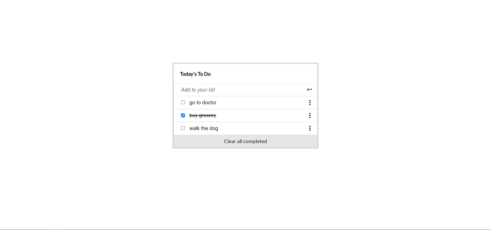

# Todo List Website

## Built with

- HTML
- CSS
- JavaScript
- Webpack

## Live link

[Live Demo](https://abdulrahmanshr75.github.io/Todo-List/)

## Usage

start by cloning this repository by running:

git clone [url](https://github.com/abdulrahmanshr75/Todo-List.git)

cd into the folder

install all the packages needed by this command :

npm install

you can run this website on live server port 8080 by this command :

npm run start

to build the project run :

npm run build

## Author

👤 Abdulrahman Shrshar

- [Github Account](https://github.com/abdulrahmanshr75)
- [Linkedin Account](https://www.linkedin.com/in/abdulrahman-shrshar-721144161/)

## Show your support

Give a ⭐️ if you like this project!
