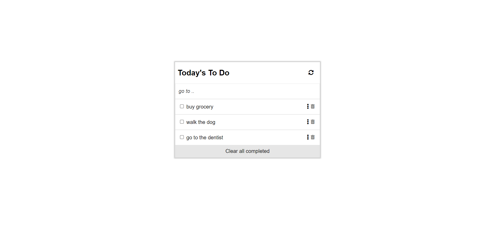

# Todo List Website



## Built with

- HTML
- CSS
- JavaScript
- Webpack

## Live link

[Live Demo]()

## Usage

start by cloning this repository by running:

```
git clone https://github.com/abdulrahmanshr75/Todo-List.git
```

cd into the folder

```

install all the packages needed by this command

```

npm install

```

you can run this website on live server port 8080 by this command

```

npm run start

```
to build the project run:

```

npm run build

```


## Author

👤 Abdulrahman Shrshar

- GitHub: (https://github.com/abdulrahmanshr75)
- LinkedIn: (https://www.linkedin.com/in/abdulrahman-shrshar-721144161/)

## Show your support

Give a ⭐️ if you like this project!
```
